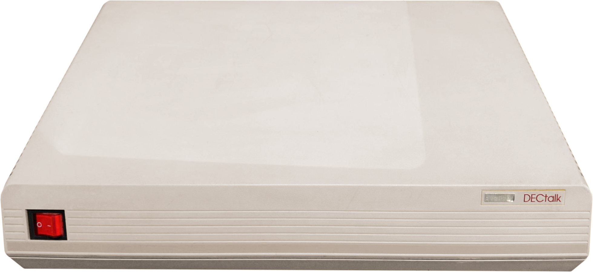

# DECtalk DTC-01 Reborn

The DECtalk DTC-01 (v1.8) firmware decompiled and rebuilt as C: a speech library and the programs that use it. The build needs no ROMs.

Project notes: [AGENTS.md](AGENTS.md) and [REFERENCE.md](REFERENCE.md).

| Program                        | What it is                                                                                 |
| ------------------------------ | ------------------------------------------------------------------------------------------ |
| `DECtalk.dll` / `libtts_us.so` | the speech library, with dapi's `TextToSpeech…` API ([src/api/ttsapi.h](src/api/ttsapi.h)) |
| `say`                          | speaks its arguments or standard input                                                     |
| `speak`                        | a text editor that speaks (Win32 on Windows, GTK 3 on Linux)                               |
| `dtc01term`                    | the unit's host terminal: host line, local terminal with SETUP, and a simulated phone line |

## Building

CMake 3.21+ and Ninja on Windows; everything lands in `build/bin` (on Linux the library in `build/lib`).

**Windows, 64-bit** (from an x64 developer prompt, `vcvars64.bat`):

```bash
cmake --preset x64
```

```bash
cmake --build --preset x64
```

For 32-bit, use the `x86` preset from an x86 prompt (`vcvars32.bat`); it builds into `build/x86`.

**Linux** (gcc; `speak` needs `libgtk-3-dev` and is skipped without it; ALSA is loaded at run time):

```bash
cmake --preset linux
```

```bash
cmake --build --preset linux
```

## Using the programs

### say

```bash
say "[:np] Hello, world."
```

```bash
say -w hello.wav Hello, world.
```

- With no text, `say` reads standard input (a terminal line is spoken on RETURN).
- `-w FILE`: write a 16-bit, 10 kHz wave file instead of playing.
- `-l FILE` / `-lp FILE`: log the text or its phonemes.
- `-d FILE`: load a user dictionary.
- `-pre TEXT` / `-post TEXT`: text sent before and after the input, e.g. `-pre "[:nb]"`.
- Text starting with `-` needs a second dash (`--5 degrees`). `say -h` lists everything.

### speak

```bash
speak [FILE [USER-DICTIONARY]]
```

Type or open text and speak it. It has buttons for the nine voices, a rate slider, a user dictionary, conversion to
a wave file and word highlighting. Right-click speaks the selection.

### dtc01term (host terminal emulator)

```bash
dtc01term [--host LINE] [--local LINE] [--phone sim|none] [-w FILE] [-d N] [-q]
```

- `LINE` is `console`, `stdio`, `tcp:[addr:]port`, `com:NAME` or `none`. The defaults are `--host tcp:127.0.0.1:2001
  --local console --phone sim`: connect a host program (or `telnet 127.0.0.1 2001`) to send text and escape sequences,
  and type on the console as the local terminal.
- `-w FILE` speaks into a wave file; `-d N` picks the audio device; `-q` skips the power-up banner.
- On the local terminal, `Ctrl+]` then:
  - `b`: BREAK, which enters SETUP;
  - `r`: the phone rings once;
  - `0`-`9`, `*`, `#`, `A`-`D`: the caller presses that key;
  - `q`: quit.
